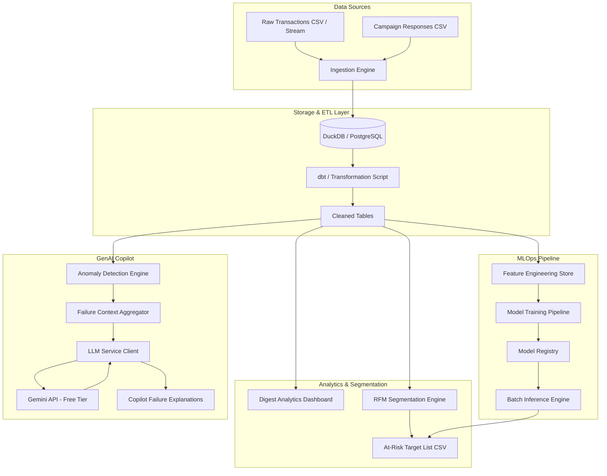

# Paymob DS Intern Assessment: Production Architecture & Insights

This repository contains the complete solution for the Paymob Data Science Intern Assessment. The solution is structured into a modular, production-ready system consisting of custom Python modules for ETL, customer segmentation, machine learning training, and a GenAI-powered merchant support Copilot.

---

## 🏗️ Production System Architecture

The following diagram illustrates the end-to-end data flow and MLOps pipeline designed for this assessment:



### 1. Data Processing & ETL (`src/data_processor.py`)
Processes raw data files using high-performance Pandas transformations. Key cleaning operations address the data quality issues detailed in the PRD:
* **Payment Method Case/Spacing Inconsistency**: Normalizes to 5 standard classes (`card`, `wallet`, `instapay`, `installment`, `cash_on_delivery`).
* **Duplicates**: Drops exact duplicates based on `transaction_id`.
* **Negative Values**: Normalizes negative values for `refunded` rows using the absolute value, and drops negative values for successful transactions.
* **Missing Cities**: Imputes missing customer cities as `"Unknown"`.
* **Orphaned Failure Reasons**: Clears failure reasons for non-failed transactions.
* **Timezone Normalization**: Converts timestamps from UTC to Africa/Cairo (UTC+2) local time to prevent 2-hour shifts in time-of-day peak transaction analyses.

### 2. RFM Segmentation (`src/segmenter.py`)
Computes customer-level RFM metrics using **only successful transactions** up to the reference date `2025-06-30`:
* **Recency**: Days elapsed since the customer's last successful transaction.
* **Frequency**: Count of successful transactions.
* **Monetary**: Sum of amount spent in EGP.
* Custom quintile-based scoring (ranks 1 to 5) classifies customers into business segments. It extracts the **At-Risk** cohort (high historical spend and purchase frequency but low recency) and outputs the targeting list to [target_customers_at_risk.csv](target_customers_at_risk.csv).

### 3. Predictive Modeling (`src/model_trainer.py`)
A predictive pipeline for campaign responses:
* **Leakage-Free Feature Store**: Standardizes feature engineering by enforcing a strict temporal cutoff on transactions (`timestamp_utc < 2025-04-15`), ensuring no transactions occurring on or after the campaign launch date leak information into features.
* **Models**: Compares a Logistic Regression baseline against a Random Forest Classifier.
* **Cross-Validation**: Uses 5-fold Stratified Cross-Validation on the training split to optimize hyperparameters while maintaining response rate balance.
* **Imbalance Treatment**: Implements internal class weight balancing (`class_weight='balanced'`) to prevent accuracy bias.

### 4. GenAI Merchant Support Copilot (`src/copilot_failures.py`)
An automated assistant that helps support teams explain merchant-level transaction failures:
* **Anomaly Engine**: Employs Z-scores to identify merchants with transaction failure rates exceeding `mean + 2 * std` (calculated over merchants with at least 50 transactions to ensure statistical validity).
* **Token Optimization & Context Aggregation**: Instead of passing raw, verbose transaction logs to the LLM, the engine aggregates failures by reason, payment method, and channel, compiling a small JSON object.
* **Gemini Client & Rate-Limiting**: Utilizes the Google Gemini API (via the `google-generativeai` SDK). It implements an exponential backoff decorator to handle free-tier API rate limits (`429` errors) and falls back gracefully to high-quality simulated reports if no API key is configured.

---

## 📈 Summary of Key Analytical Findings

Upon running the notebook, the key findings will be plotted and displayed:

### Task 1 — DIGEST Insights
* **Headline KPIs**: Outputs settled GMV, success/failure rates, average ticket sizing, and refund metrics.
* **Ramadan Trends**: Visualizes monthly settled GMV overlaid with shaded regions indicating Ramadan periods. Historically, spending pattern shifts occur leading up to and during Ramadan.
* **Online vs. POS Heatmaps**: Hour-of-day by day-of-week heatmaps show distinct patterns. POS transactions are concentrated during afternoon/evening hours (high retail/dining volumes), while Online transactions show a more distributed pattern stretching late into the night.
* **MCC Refund Rankings**: Identifies MCC categories with the highest refund ratios (`refunded / (success + refunded)`), allowing risk teams to flag high-exposure categories.
* **Spend Segments**: Segments customers into Mass (bottom 40%), Mid (20%-60%), and High (top 20%) spending tiers.

### Task 2 — REACH Segments
* Extracts the **At-Risk** customer cohort. These customers represent highly valuable historic shoppers who haven't completed a transaction recently. They are target targets for win-back discounts.

### Task 3 — Predictor Performance
* Compares models using **ROC-AUC** and **F1-Macro** metrics on the test set.
* Features like `recency_days`, `frequency_90d`, and `spend_90d` show high importance in predicting campaign response.

### Task 4 — Copilot Diagnostics
* Identifies outlier merchants with abnormal failure spikes.
* Provides structured reports translating technical errors (like `3ds_authentication_failed` or `timeout`) into clear integration recommendations.

---

## 🛠️ Installation & Execution Guide

### 1. Setup Environment
Ensure Python 3.10+ is installed on your Windows system. Clone the repository and navigate to the folder:

```powershell
# Create a virtual environment
python -m venv .venv

# Activate the virtual environment
.venv\Scripts\Activate
```

### 2. Install Dependencies
Install packages listed in the requirements file:
```powershell
python -m pip install -r requirements.txt
```

### 3. Configure API Key
Create a `.env` file in the root directory and add your free Gemini API key (obtainable from [Google AI Studio](https://aistudio.google.com/)):
```env
GEMINI_API_KEY=AIzaSy...
```

### 4. Running the Code
To run the full assessment notebook and generate charts:
* Open a terminal with your virtual environment active and run:
  ```powershell
  jupyter notebook paymob_assessment.ipynb
  ```
* Click "Run All Cells" to perform the EDA, segmentations, train the machine learning models, and invoke the Copilot recommendations.

---

## 💡 "If I Had More Time" — Next Steps
1. **Dynamic Streaming & Feature Stores**: Transition from static feature engineering to a real-time feature store (like Feast). This would allow features (like rolling hourly failure rates) to be updated instantly in a production streaming environment (Kafka/Flink).
2. **Uplift Modeling**: Instead of predicting standard campaign response probability, implement Uplift Modeling (e.g., CausalML or Double Machine Learning) to predict the *incremental* lift of campaigns, ensuring marketing budgets are spent only on customers who require a nudge, rather than those who would have bought anyway (the "Sure Things").
3. **Advanced LLM Guardrails & RAG**: Connect the Copilot to Paymob's developer documentation using Retrieval-Augmented Generation (RAG). This would allow the LLM to output precise code snippets matching the merchant's programming language (e.g. PHP, Node.js, Python) to resolve integration issues (like incorrect webhook responses).
4. **Enhanced Outlier Handling**: Implement more advanced merchant categorization to adjust GMV benchmarks, automatically separating B2B distributors from standard retail merchants.
